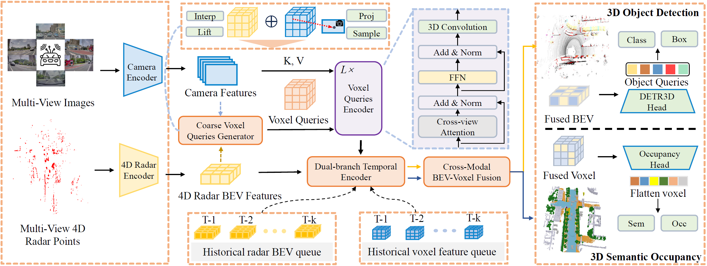
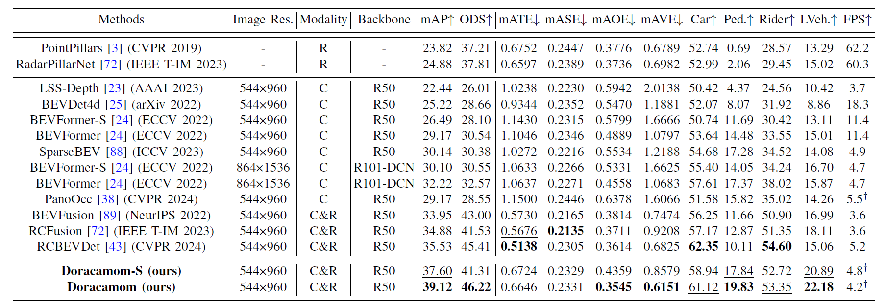
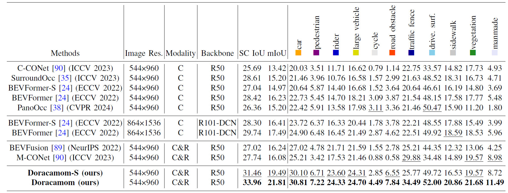
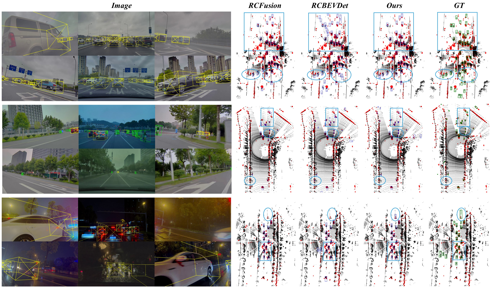
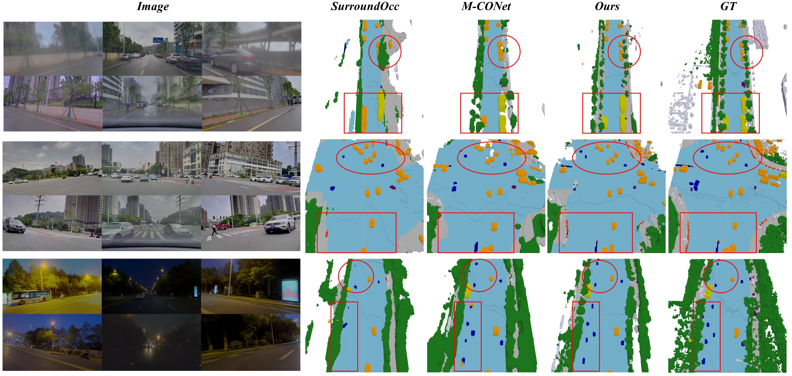

<div align="center">

# Doracamom: Joint 3D Detection and Occupancy Prediction with Multi-view 4D Radars and Cameras for Omnidirectional Perception

<sup>1</sup>Lianqing Zheng, <sup>2</sup>Jianan Liu, <sup>3</sup>Runwei Guan, <sup>1</sup>Long Yang, <sup>1</sup>Shouyi Lu, <br><sup>4</sup>Yuanzhe Li, <sup>5</sup>Xiaokai Bai, <sup>6</sup>Jie Bai, <sup>1</sup>Zhixiong Ma<sup>†</sup>, <sup>5</sup>Hui-Liang Shen, <sup>1</sup>Xichan Zhu

<sup>1</sup>Tongji University, <sup>2</sup>Momoni AI, <sup>3</sup>HKUST (Guangzhou)  
<sup>4</sup>Technische Universität Berlin, <sup>5</sup>Zhejiang University, <sup>6</sup>Hangzhou City University

</div>

<p align="center">
  <a href="https://arxiv.org/abs/2501.15394" target='_blank'>
    
  </a>
  <a href="https://arxiv.org/abs/2501.15394" target='_blank'>
    
  </a> 
  <a href="https://github.com/TJRadarLab/Doracamom" target='_blank'>
    
  </a>
  <a href="https://github.com/TJRadarLab/Doracamom" target='_blank'>
    
  </a>
  <a href="https://github.com/tatsu-lab/stanford_alpaca/blob/main/LICENSE" target='_blank'>
  
  </a>
</p>

## 🔥 News
• **[2026-01-22]** 🚀 Our codebase and models have been released.

• **[2026-01-19]** 🎉🎉🎉 Our paper have been accepted by IEEE TCSVT.

• **[2025-01-26]** 🌐 The paper has been submitted to [ArXiv](https://arxiv.org/abs/2501.15394v3).

## 🛠️ Abstract
In this paper, we propose Doracamom, the first framework that fuses multi-view cameras and 4D radar for joint 3D object detection and semantic occupancy prediction, enabling comprehensive environmental perception. Specifically, we introduce a novel **Coarse Voxel Queries Generator (CVQG)** that integrates geometric priors from 4D radar with semantic features from images to initialize voxel queries, establishing a robust foundation for subsequent refinement. To leverage temporal information, we design a **Dual-Branch Temporal Encoder (DTE)** that processes multi-modal temporal features in parallel across BEV and voxel spaces. Furthermore, we propose a **Cross-Modal BEV-Voxel Fusion (CMF)** module that adaptively fuses complementary features through attention mechanisms. Extensive experiments on OmniHD-Scenes, VoD, and TJ4DRadSet demonstrate that Doracamom achieves state-of-the-art performance.

<div align="center">
  
</div>
<div align="center">
  <b>The overall framework of Doracamom</b>
</div>

## 🔨 Quick Start

### Installation
You can install the whole repository by following these steps:


Clone
```
git clone https://github.com/TJRadarLab/Doracamom.git
```
Create environment 
```
conda create -n doracamom python=3.8 -y
conda activate doracamom
```
Install pytorch
```
pip install torch==1.9.1+cu111 torchvision==0.10.1+cu111 torchaudio==0.9.1 -f https://download.pytorch.org/whl/torch_stable.html
```

Install MMCV Family
```
pip install mmcv-full==1.4.0 -f https://download.openmmlab.com/mmcv/dist/cu111/torch1.9.0/index.html
pip install mmdet==2.14.0
pip install mmsegmentation==0.14.1
```
Install MMDet3D
```
git clone https://github.com/open-mmlab/mmdetection3d.git
cd mmdetection3d
git checkout v0.17.1 
pip install -v -e .  
```

Install Detectron2 and Timm
```
pip install einops fvcore seaborn iopath==0.1.9 timm==0.6.13 typing-extensions==4.5.0 pylint ipython==8.12 numpy==1.19.5 matplotlib==3.5.2 numba==0.48.0 pandas==1.4.4 scikit-image==0.19.3 setuptools==59.5.0
python -m pip install 'git+https://github.com/facebookresearch/detectron2.git'
pip install yapf==0.40.1
```
Compile CUDA Operators
```
# 1. Compile bevpool operator
python projects/setup.py develop

# 2. Compile bevpoolv2 operator
python projects/setup_bevdet.py develop

# 3. Compile DFA3D
cd deform_attn_3d 
python setup.py build_ext --inplace

# 4. Install torch_scatter
pip install torch_scatter==2.1.1
```

**Data Preparation**

Please refer to [OmniHD-Scenes](https://github.com/TJRadarLab/OmniHD-Scenes) for dataset preparation.

**Training & Testing**
```
# 1. Training
./tools/dist_train.sh projects/configs/Doracamom/Doracamom.py 2
# 2. Testing
./tools/dist_test.sh projects/configs/Doracamom/Doracamom.py ckpts/doracamom_omnihd.pth 2
```

# 🍁 Baseline Results
<div align="center">  </div> <div align="center"> <b>3D Object Detection on OmniHD-Scenes </b> </div>

<div align="center">  </div> <div align="center"> <b>3D Semantic Occupancy on OmniHD-Scenes </b> </div>

# 🚀 Model Zoo
|      Methods       |       Modality       | mAP | ODS |  SC IoU  | mIoU |    Models                         |
| :--------------------------------------------------------: | :------: | :------: | :------: | :--------: | :-------: | :----------------------------------------------------------: |
| [Doracamom](projects/configs/Doracamom/Doracamom.py) | C+R |   39.12    |   46.22    |   33.96   |   21.81   | [Link](https://pan.baidu.com/s/1FGN1vSbR6nIQCNpDwDQ0rQ?pwd=uc3f)|


|      Methods       |    mAP |    Models                         |
| :--------------------------------------------------------: | :------: | :----------------------------------------------------------: |
| [Doracamom_vod](projects/configs/Doracamom/Doracamom_vod.py) |   59.76   | [Link](https://pan.baidu.com/s/1l2loPmbbiMDOYOtSh0kB-w?pwd=hdwn) |
| [Doracamom_tj4d](projects/configs/Doracamom/Doracamom_TJ4D.py) |   44.24   | [Link](https://pan.baidu.com/s/1XV6jHZQrur2ZBc9Yw4XNIA?pwd=yw9i) |

|      Methods       |       Models                         |
| :--------------------------------------------------------:| :----------------------------------------------------------: |
| fcos3d_pretrain|  [Link](https://github.com/zhiqi-li/storage/releases/download/v1.0/r50_fcos3d_pretrain.pth) |
| RadarPillarNet |    [Link](https://pan.baidu.com/s/12DjKyFX-36e8feg54ZGY-w?pwd=TJ4D) |

# 🎬 Visualization
<div align="center">  </div> <div align="center"> <b>Qualitative comparison for 3D object detection </b> </div>

<div align="center">  </div> <div align="center"> <b>Qualitative comparison for semantic occupancy prediction </b> </div>

# 😙 Acknowledgement
Many thanks to these exceptional open source projects:
- [mmdet3d](https://github.com/open-mmlab/mmdetection3d)
- [BEVFormer](https://github.com/fundamentalvision/BEVFormer)
- [PanoOcc](https://github.com/Robertwyq/PanoOcc)
- [RCBEVDet](https://github.com/VDIGPKU/RCBEVDet)

# ⭐ Contact
If you have any questions about the repo, feel free to cantact us with tjradarlab@163.com or zhenglianqing@tongji.edu.cn.
# 📃 Citation
If you find this project useful in your research, please consider citing:
```
@article{zheng2025doracamom,
  title={Doracamom: Joint 3D Detection and Occupancy Prediction with Multi-view 4D Radars and Cameras for Omnidirectional Perception},
  author={Zheng, Lianqing and Liu, Jianan and Guan, Runwei and Yang, Long and Lu, Shouyi and Li, Yuanzhe and Bai, Xiaokai and Bai, Jie and Ma, Zhixiong and Shen, Hui-Liang and Zhu, Xichan},
  journal={arXiv preprint},
  year={2025}
}
```